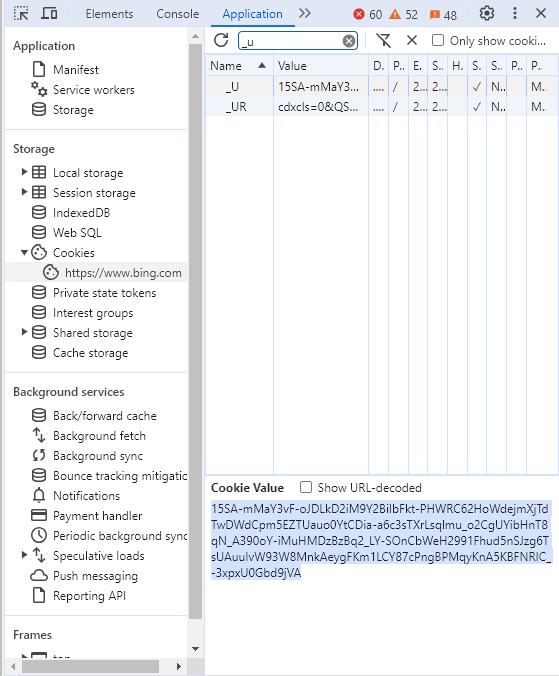
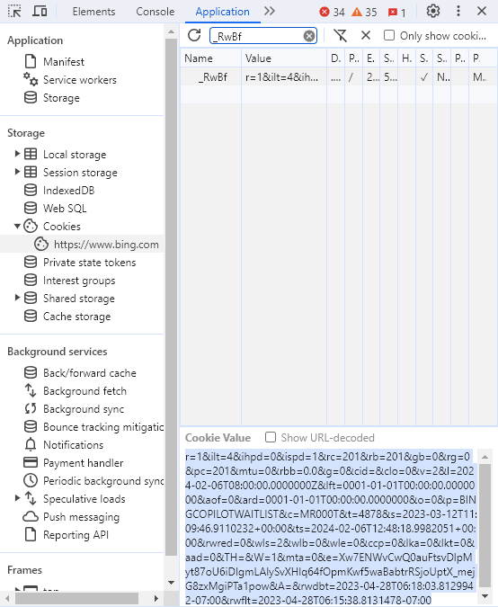

<h1 align="center">AI Copilot (Bing AI)</h1>

# Ngôn ngữ khác
> Tác giả gốc: [Harry-zklcdc/go-proxy-bingai](https://github.com/Harry-zklcdc/go-proxy-bingai)

> English language: [AI-Copilot-EN](https://github.com/chokiproai/AI-Copilot-EN)

## 📦 CodeSandBox
> ## 

## Giới Thiệu
- ⭐ Dựa trên Microsoft New Bing, trang web Microsoft New Bing được tùy chỉnh đơn giản với Vue3 và Go. Nó có trải nghiệm giao diện người dùng nhất quán, hỗ trợ các từ nhắc ChatGPT, có sẵn và về cơ bản tương thích với tất cả các chức năng của Microsoft Bing AI. có thể trò chuyện mà không cần đăng nhập.

- ⭐ Khi máy chủ trò chuyện chính thức Bing (tương đối nhanh và ổn định, được khuyến nghị), bạn có thể tham khảo các giải pháp sau

- ⭐ Máy chủ trò chuyện (mặc định là "Trang web của bạn"). Số lượng yêu cầu được giới hạn ở 100.000 mỗi ngày. Nó có thể được chuyển đổi trong Cài đặt => Lựa chọn dịch vụ ở góc trên bên phải.

- ⭐ Có sẵn (máy chủ triển khai được kết nối trực tiếp với www.bing.com mà không cần chuyển hướng CN và có thể định cấu hình kết nối)

- ⭐ Hỗ trợ từ vựng nhắc nhở ChatGPT mã nguồn mở hiện có

- ⭐ Khi bạn cần các chức năng nâng cao như vẽ, v.v. (bạn cần ra lệnh).

- ⭐ Nếu bạn gặp bất kỳ vấn đề nào, trước tiên hãy nhấp vào góc dưới bên trái! Hãy thử, nếu nó không hoạt động, hãy sử dụng phương pháp làm mới (Shift + F5 hoặc Ctrl + Shift + R hoặc cài đặt ở góc trên bên phải và chọn xóa cookie) và mẹo cuối cùng là xóa bộ nhớ đệm và cookie của trình duyệt, chẳng hạn như (giới hạn 24 giờ, lời nhắc chưa đăng nhập, v.v.)

- ⭐ Yêu cầu chọn Chế độ hội thoại sáng tạo

## Link 

>⭐ [Chat AI]()

>⭐ [Image Creator]()

## Video

>⭐[Chat AI](https://onedrive.live.com/embed?resid=750758803F9E18F7%21169&authkey=!AGg5_c6ntyVBk0s)

>⭐[Image Creator](https://onedrive.live.com/embed?resid=750758803F9E18F7%21170&authkey=!AA6KYWKRIIZ2_Ug)

### Cách nhận BING COOKIE (Nếu muốn dùng cho Image Creator + Plugins)

> Định cấu hình BING COOKIE có nghĩa là bạn chia sẻ tài khoản của mình với tất cả những người sử dụng dịch vụ này, chức năng vẽ không cần đăng nhập thì nên đặt biến này. Mở www.bing.com và đăng nhập, sau đó Copy theo hình dưới đây:
#### _U Cookie

#### _RwBf Cookie

## Tất cả

- [x] Soạn
- [x] Tái cấu trúc Vue3
- [x] Từ gợi ý
- [x] Lịch sử trò chuyện
- [x] Xuất tin nhắn sang cục bộ (Markdown, hình ảnh, PDF)
- [x] Kiểm soát truy cập đơn giản
- [x] Hỗ trợ lệnh gọi API định dạng OpenAI - [🤔 API OpenAI](https://github.com/chokiproai/AI-Copilot-EN/issues/3)